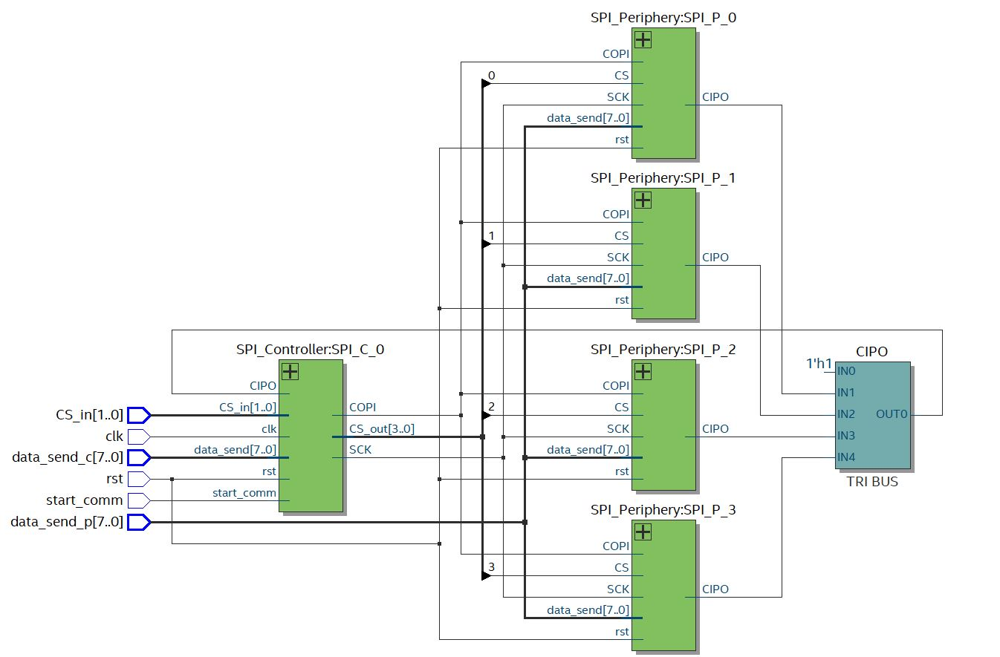

# SPI Communication Protocol

> SystemVerilog SPI communication protocol  

Implementention in SystemVerilog of __SPI Communication protocol__.  

## Get Started

The source files  are located at the repository root:

- [SPI Controller](./SPI_Controller.sv)
- [SPI Periphery](./SPI_Periphery.sv)
- [SPI High Arch.](./SPI.sv)
- [SPI TB](./SPI_TB.sv)

## Testbench

The testbench comprises three tests covering single-controller-single-periphey system and single-master-multiple-peripheral unit scenarios.
The SPI communication protocol sub-modules are teste for a single-master and four peripheral units. This is illustrated in the following figure taken from the RTL-viewer in Quartus environment:

 

## Support

I will be happy to answer any questions.  
Approach me here using GitHub Issues or at tom.urkin@gmail.com