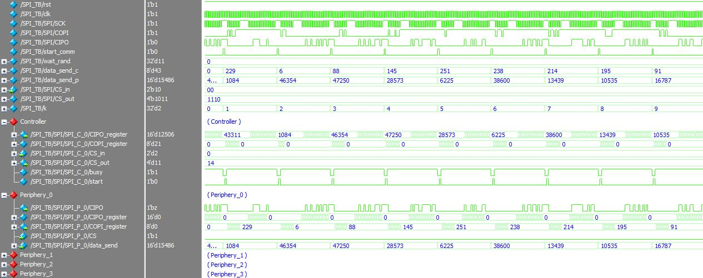
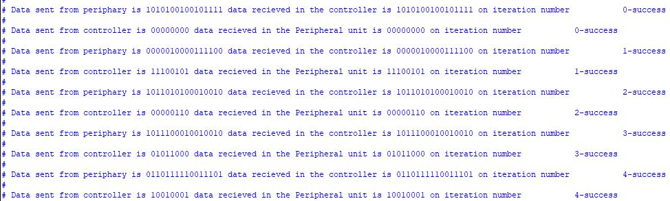
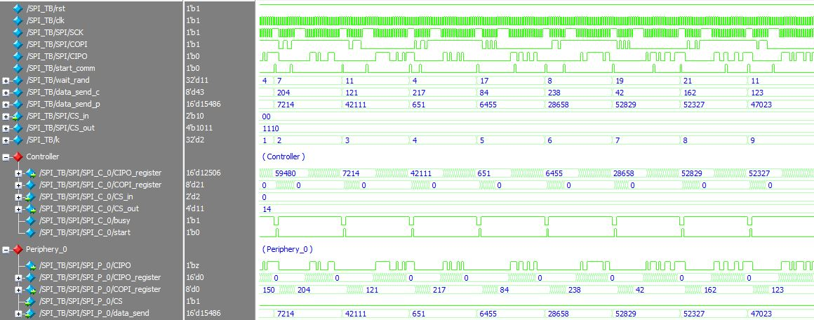
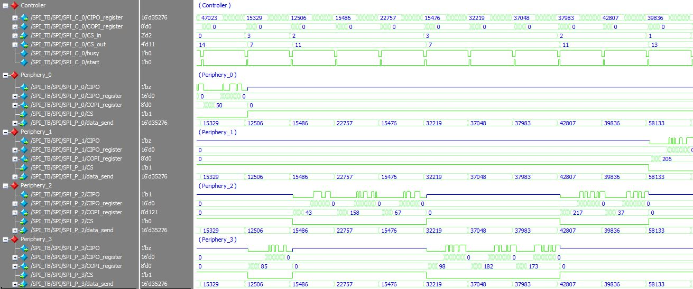
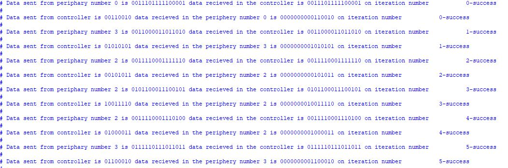

# SPI Communication Protocol

> SystemVerilog SPI communication protocol  

Implementention in SystemVerilog of __SPI Communication protocol__.  

## Get Started

The source files  are located at the repository root:

- [SPI Controller](./SPI_Controller.sv)
- [SPI Periphery](./SPI_Periphery.sv)
- [SPI High Arch.](./SPI.sv)
- [SPI TB](./SPI_TB.sv)

## Testbench

The testbench comprises three tests covering controller with single periphey unit and multiple-peripheral unit systems.
The SPI communication protocol sub-modules are teste for a single-master and four peripheral units. This is illustrated in the following figure taken from the RTL-viewer in Quartus environment:

 

1.	Communication between a single periphery unit and the controller
	Here the data sent from the controller to the peripheral unit is 8-bit long, the recieved data is 16-bit long and a halt of 5 cycles is enforced betweeb communication intervals (can be observed in the SCK signal). 
	The peripheral unit is 'Periphety_0' (CS==2'b00) and therefore the CIPO line of the other units is 1'bz. The sent words (data_send_p, data_send_c) are randomly generated and compared with the recieving regiters in the controller/periphery unit. 	
	
	**Communication between a single periphery (waveform):**
		 
		
	**Communication between a single periphery (terminal):**
				
	
	Note: all communication parameters are defined as constants which can be overidden to comply with different data length, pause interval etc. 
	
2.	Initiating communication when communication is taking place
	Communication initiation is carried at the rising edge of 'start_comm' signal. This test verifies that re-trigerring of this signal does not affect ongoing communication activities. 
	Here, a re-trigerring event occurs after 'wait_rand' (randomly generated on each iteration).
	
	**Communication between a single periphery (waveform):**
		 

3.	Multiple peripheral units system
	Communication attributes remain as in the first test. Here, there are four peripheral units communicating with the controller according to the randomly generated CS_in value. 
	As can be seen, based on the CS value the inactive peripheral units' CIPO line is 1'bz.
	
	**Multiple peripheral units system (waveform):**
		 

	**Multiple peripheral units system (terminal):**
		
		
## Support

I will be happy to answer any questions.  
Approach me here using GitHub Issues or at tom.urkin@gmail.com